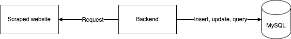
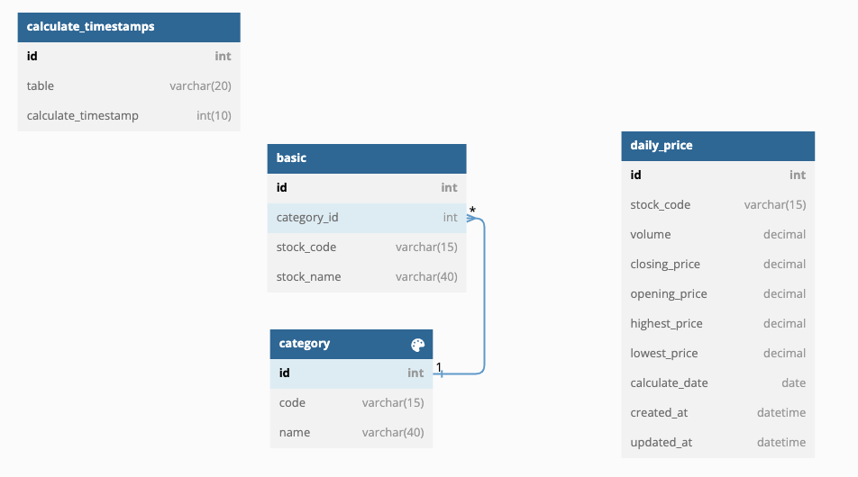

# StockInfoCrawler

## Project Purpose
- Scrape daily stock info of Taiwan

## Project Installation
- golang version: go 1.19
- install docker daemon first
```bash
# check work dir: ./StockInfoCrawler
cd deployments/
docker-compose up --force-recreate
```

## Project main used libraries
- Go-colly, Go-goquery is used by scraped dataq
- Go-gorm is used by operate database
- Go-gron is used by schedule tasks

## project architecture
- Architecture



- db_diagram


## Contributing
Pull requests are welcome. For major changes, please open an issue first to discuss what you would like to change.
Please make sure to update tests as appropriate.

## License
[MIT](https://choosealicense.com/licenses/mit/)
